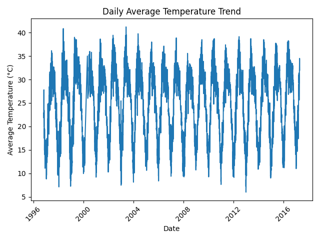
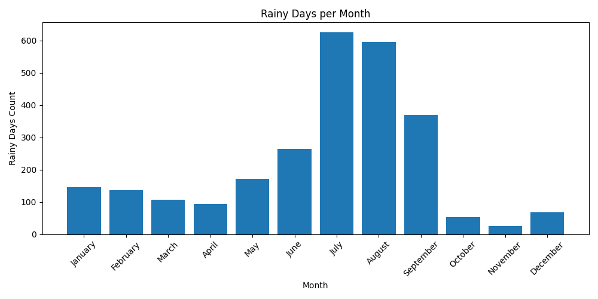
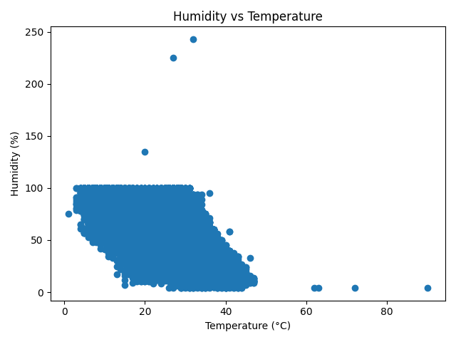
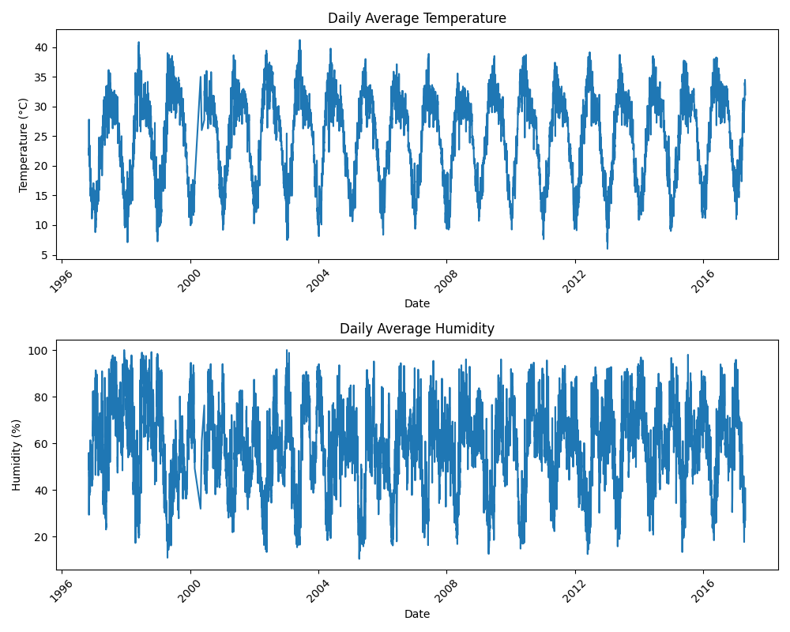

# 🌦️ Weather Data Visualizer – Tanishq

This project is a weather data analysis and visualization tool created for the **Programming for Problem Solving using Python** course.  
It processes real-world Delhi weather datasets, cleans them, computes statistics, generates visualizations, and creates a summary report.

---

## 📂 Project Folder Structure

```
weather-data-visualizer-tanishq/
│
├── data/
│   ├── raw_weather.csv
│   └── cleaned_weather.csv
│
├── plots/
│   ├── combined_plots.png
│   ├── daily_temperature.png
│   ├── humidity_vs_temperature.png
│   └── monthly_rainfall.png
│
├── weather_analysis.py
├── report.md
├── README.md
├── requirements.txt
└── test.py (optional)
```

---

## 📊 Dataset Sources

### **1. TUMI Data Hub – Delhi Weather Data**  
https://hub.tumidata.org/dataset/delhi_weather_data_delhi/resource/b5ebdc3d-e8a1-13c9-b6c3-9458272d540e

### **2. Kaggle – Delhi Weather Dataset**  
https://www.kaggle.com/datasets/mahirkukreja/delhi-weather-data

---

## 🧰 Tools & Libraries Used

Install all dependencies:

```
pip install -r requirements.txt
```

Libraries used:
- Python 3+
- Pandas  
- NumPy  
- Matplotlib  
- Tabulate  

---

## 📝 Assignment Tasks Completed

### ✔ Task 1 — Data Acquisition & Loading  
Loaded dataset and inspected structure.

### ✔ Task 2 — Data Cleaning & Processing  
Handled missing values, fixed column types, created helper columns.

### ✔ Task 3 — Statistical Analysis  
Computed daily, monthly, yearly temperature statistics.

### ✔ Task 4 — Visualization  
Generated multiple weather-related plots (shown below).

### ✔ Task 5 — Grouping & Aggregation  
Grouped data by month & season to compute insights.

### ✔ Task 6 — Exporting & Reporting  
Exported cleaned dataset and generated markdown report.

---

# 📸 Plots Generated

### 🌡 Daily Temperature Trend


### 🌧 Monthly Rainfall / Rainy Days


### 💧 Humidity vs Temperature


### 📊 Combined Temperature & Humidity Plot


---

## ▶️ How to Run the Project

```
pip install -r requirements.txt
python weather_analysis.py
```

---

## 👤 Author  
**Tanishq**  
B.Tech CSE (Cyber Security)  
KR Mangalam University
